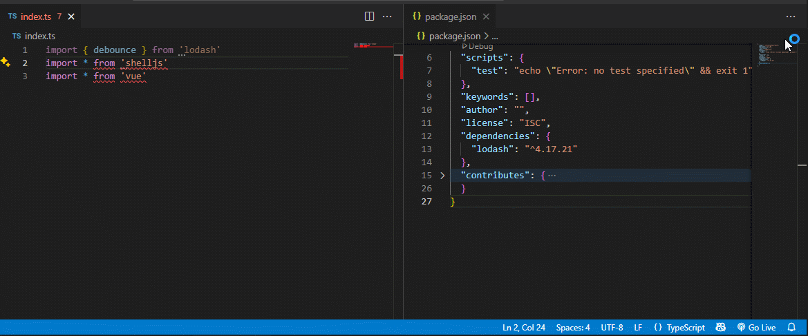

<p align='center'>
    
</p>

## Description

A vscode extention to install dependencies just one click.

No need to `pnpm/npm/yarn add xx` for each times.

## Example
<p align='center'>
    
</p>

## Config

#### pkgManager
If you don't set this config, found by this order automatically.
```json
{
  "click-install.pkgManager": {
    "type": "string",
    "enum": [
      "pnpm",
      "yarn",
      "npm"
    ],
    "description": "Preferred package manager for click-instal."
  }
}
```

## License

[MIT](./LICENSE.md) License © 2025 [Nick Wu]
